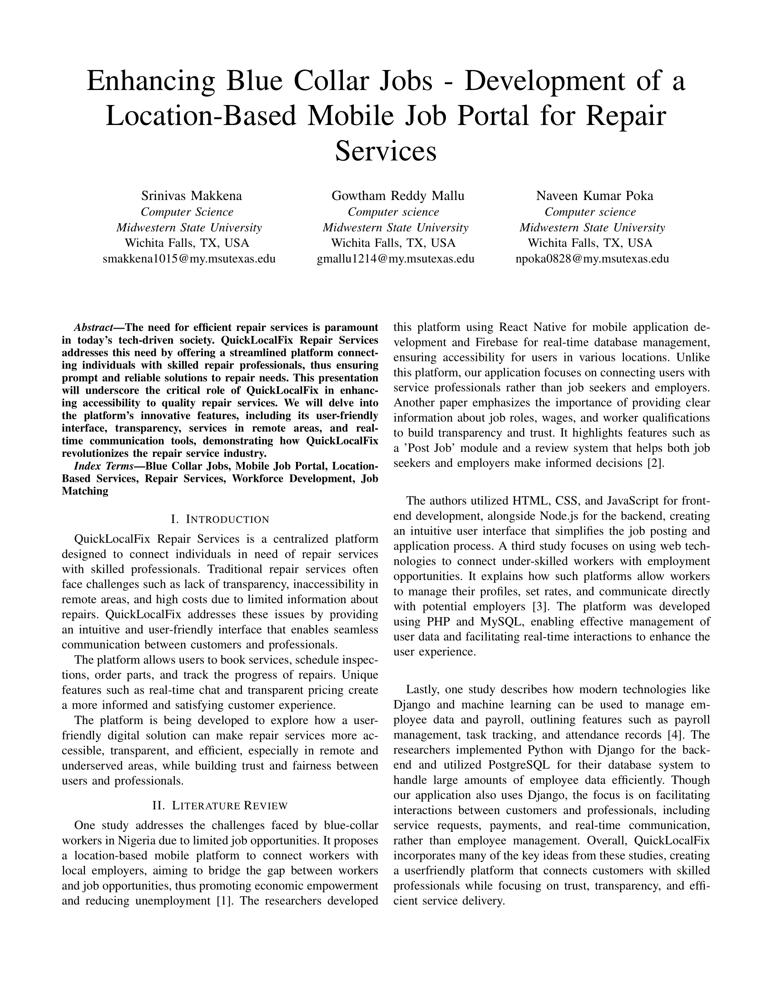
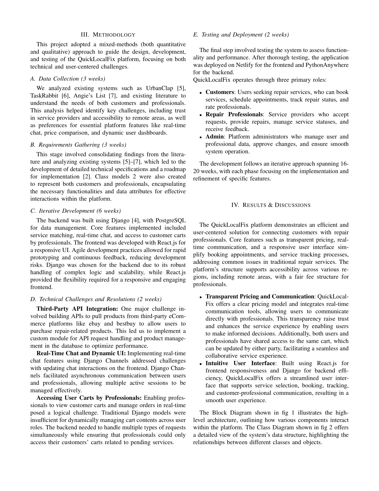
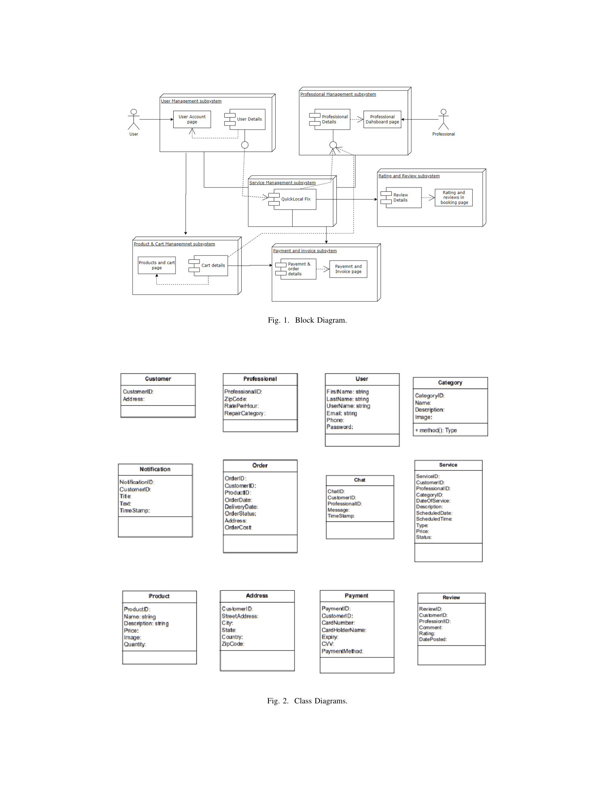
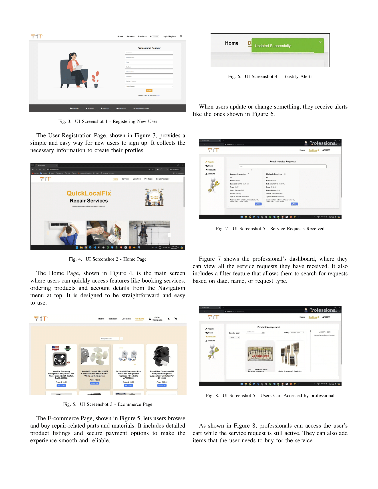
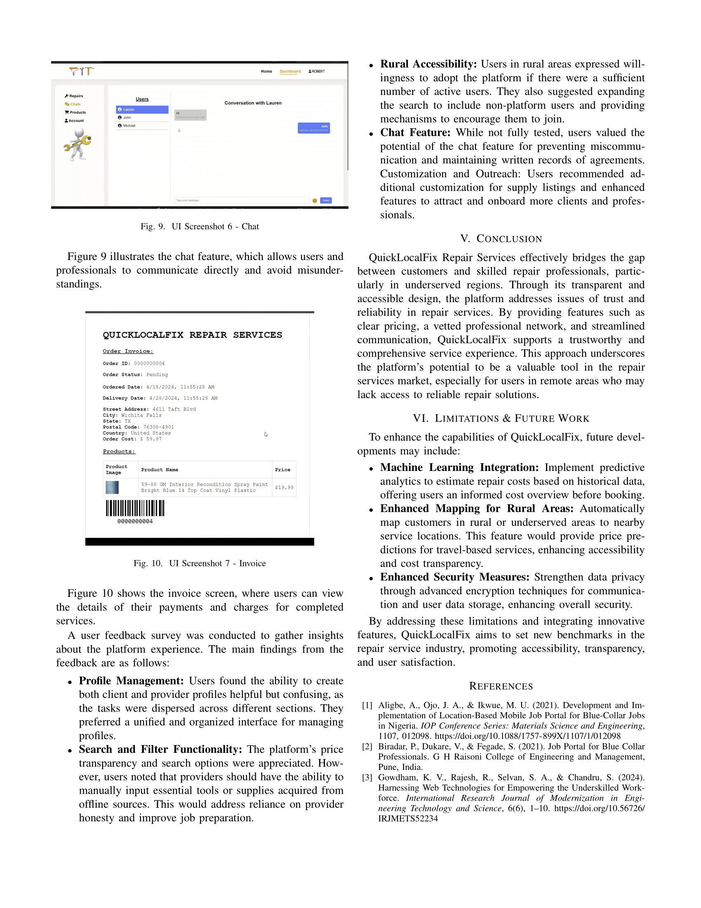

# Research-Methods in Computer Science - Midwestern State University
# Enhancing Blue Collar Jobs - Development of a Location-Based Mobile Job Portal for Repair Services

## Authors
- **Srinivas Makkena**  
  Computer Science, Midwestern State University, Wichita Falls, TX, USA  
  [smakkena1015@my.msutexas.edu](mailto:smakkena1015@my.msutexas.edu)
- **Gowtham Reddy Mallu**  
  Computer Science, Midwestern State University, Wichita Falls, TX, USA  
  [gmallu1214@my.msutexas.edu](mailto:gmallu1214@my.msutexas.edu)
- **Naveen Kumar Poka**  
  Computer Science, Midwestern State University, Wichita Falls, TX, USA  
  [npoka0828@my.msutexas.edu](mailto:npoka0828@my.msutexas.edu)

## Abstract
The need for efficient repair services is paramount in today’s tech-driven society. **QuickLocalFix Repair Services** addresses this need by offering a streamlined platform connecting individuals with skilled repair professionals, thus ensuring prompt and reliable solutions to repair needs. This presentation will underscore the critical role of QuickLocalFix in enhancing accessibility to quality repair services. We will delve into the platform’s innovative features, including its user-friendly interface, transparency, services in remote areas, and real-time communication tools, demonstrating how QuickLocalFix revolutionizes the repair service industry.

## Key Highlights
- **User-Friendly Interface**: Simplifies booking, scheduling, and tracking repair services.
- **Real-Time Communication**: Facilitates seamless interaction between customers and professionals.
- **Transparent Pricing**: Builds trust with clear and upfront pricing information.
- **Accessibility**: Ensures service availability in remote areas.

## Methodology
A mixed-methods approach guided the design, development, and testing of QuickLocalFix, focusing on technical and user-centered challenges:
- **Data Collection**: Analyzed existing systems and literature to identify key challenges and preferences for platform features.
- **Requirements Gathering**: Developed technical specifications and a roadmap for implementation.
- **Iterative Development**: Built the backend with Django and PostgreSQL, and the frontend with React.js, using Agile practices for rapid prototyping and continuous feedback.
- **Technical Challenges**: Resolved issues like third-party API integration for product listings from eCommerce platforms.

## Images
Below are the images of the research paper, provided in PNG format:

1

---

2

---

3

---

4

---

5

---

6

## Conclusion
This README provides an overview of the **QuickLocalFix Repair Services** project, outlining its objectives, methodologies, and the innovative features it brings to the repair service industry.
